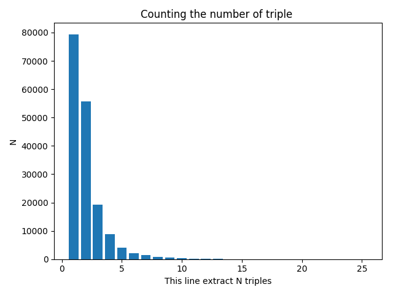
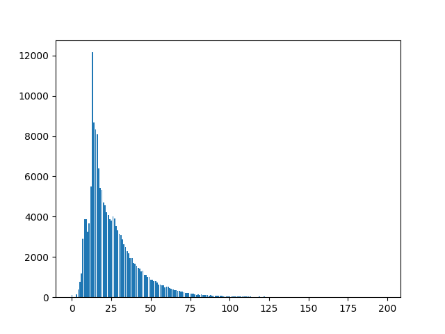

# 项目规则

+ 写文档说明
    + 每个函数写上自己的名字
    + 每个py文件前面写上这个文件主要是干啥的
+ 写测试用例
    + 每个函数至少有一个测试
+ 使用typing约束参数
    + 以便知道传参是否规范

---
文件名|功能
---|---
data|存放数据
data.original_data|存放原始数据，一般不可以修改
data.preocessed_data|存放处理之后的数据，一般是对源文件的一些统计结果，或者是fakedata之类
saved_model|我们训练好的模型都放在这里，最终的仓库，以文件夹的形式，存放最终调好的模型结果，并应有文档说明与predict脚本
test_examples|存放测试用例文件
tmp|一些输出临时可以存放的地方，重要的东西一定要放在saved_model中
tmp.imgs|存放一些图片，例如readme的图片
tmp.results|测试集预测结果放在这里
tmp.model_weight|模型的权重输出到这里
utils|我们的一些可以共用的文件都约定放在这里，要有注释
scripts|公用的，有输入输出的脚本文件，一般是独立完成某项任务
members|开发成员，大家私有的可以自由发挥的文件夹
members.renyan|个人文件夹，自由发挥
members.liangjiaxi|个人文件夹，自由发挥
members.yuzhao|个人文件夹，自由发挥
members.huangmengxuan|个人文件夹，自由发挥
---

# 信息抽取任务

## 赛题理解

+ 50个schema约束集合
  + schema定义了关系P以及其对应的主体S和客体O的类别
    + （S_TYPE:人物，P:妻子，O_TYPE:人物）
    + （S_TYPE:公司，P:创始人，O_TYPE:人物）
    
---
+ 目标：输出句子中所有满足schema约束的SPO三元组知识
  + Triples=[(S1, P1, O1), (S2, P2, O2)…]
    + (1) 输入:schema约束集合及句子sent
    + (2) 输出:句子sent中包含的符合给定schema约束的三元组知识Triples
---
+ 举例
>{"postag": 
[{"word": "如何", "pos": "r"},   
{"word": "演", "pos": "v"},   
{"word": "好", "pos": "a"},   
{"word": "自己", "pos": "r"},   
{"word": "的", "pos": "u"},    
{"word": "角色", "pos": "n"},   
{"word": "，", "pos": "w"},  
 {"word": "请", "pos": "v"},   
 {"word": "读", "pos": "v"},   
 {"word": "《", "pos": "w"},   
 {"word": "演员自我修养", "pos": "nw"},   
 {"word": "》", "pos": "w"},   
 {"word": "《", "pos": "w"},   
 {"word": "喜剧之王", "pos": "nw"},   
 {"word": "》", "pos": "w"},   
 {"word": "周星驰", "pos": "nr"},  
 {"word": "崛起", "pos": "v"},   
 {"word": "于", "pos": "p"},   
 {"word": "穷困潦倒", "pos": "a"},   
 {"word": "之中", "pos": "f"},   
 {"word": "的", "pos": "u"},   
 {"word": "独门", "pos": "n"},   
 {"word": "秘笈", "pos": "n"}],   
 "text": "如何演好自己的角色，请读《演员自我修养》《喜剧之王》周星驰崛起于穷困潦倒之中的独门秘笈", 
 "spo_list": [{"predicate": "主演", "object_type": "人物", "subject_type": "影视作品", "object": "周星驰", "subject": "喜剧之王"}]}  
 
  满足这个约束  
 {"object_type": "人物", "predicate": "主演", "subject_type": "影视作品"}

  
---
+ *43*万三元组数据、*21*万中文句子及*50*个已定义好的schema  
---
+ 数据数量如下表所示

名称|数量
---|---|
训练集|17w
验证集|2w
测试集2|2w
---
+ 统计训练集一句话可能提出的三元组的数量。
  + {1: 79411, 3: 19155, 2: 55703, 4: 8938, 8: 833, 7: 1417, 5: 4066, 6: 2186, 10: 333, 14: 40, 9: 504, 16: 26, 11: 199, 12: 136, 18: 11, 17: 19, 15: 35, 13: 66, 19: 10, 23: 3, 20: 10, 21: 4, 22: 2, 25: 1, 24: 1}
  
  
 
 ---
 + 观察一下能够提取24个三元组的那段话
 >{"postag": [{"word": "《", "pos": "w"}, {"word": "顺治与康熙", "pos": "nw"}, {"word": "》", "pos": "w"}, {"word": "又", "pos": "d"}, {"word": "名", "pos": "v"}, {"word": "《", "pos": "w"}, {"word": "康熙帝国", "pos": "nw"}, {"word": "》", "pos": "w"}, {"word": "又名", "pos": "v"}, {"word": "《", "pos": "w"}, {"word": "康熙王朝", "pos": "nw"}, {"word": "》", "pos": "w"}, {"word": "由", "pos": "p"}, {"word": "中国", "pos": "ns"}, {"word": "台湾", "pos": "ns"}, {"word": "导演", "pos": "n"}, {"word": "郑健荣", "pos": "nr"}, {"word": "、", "pos": "w"}, {"word": "余敏慧", "pos": "nr"}, {"word": "执导", "pos": "v"}, {"word": "，", "pos": "w"}, {"word": "蔡天送", "pos": "nr"}, {"word": "、", "pos": "w"}, {"word": "桂海鹏", "pos": "nr"}, {"word": "、", "pos": "w"}, {"word": "黄", "pos": "a"}, {"word": "诗", "pos": "n"}, {"word": "善", "pos": "v"}, {"word": "编剧", "pos": "n"}, {"word": "，", "pos": "w"}, {"word": "杨丽花", "pos": "nr"}, {"word": "、", "pos": "w"}, {"word": "潘丽丽", "pos": "nr"}, {"word": "、", "pos": "w"}, {"word": "陈亚兰", "pos": "nr"}, {"word": "、", "pos": "w"}, {"word": "吴梅芳", "pos": "nr"}, {"word": "、", "pos": "w"}, {"word": "许仙姬", "pos": "nr"}, {"word": "、", "pos": "w"}, {"word": "李如麟", "pos": "nr"}, {"word": "、", "pos": "w"}, {"word": "杨丽影", "pos": "nr"}, {"word": "、", "pos": "w"}, {"word": "郑丽惠", "pos": "nr"}, {"word": "主演", "pos": "v"}, {"word": "的", "pos": "u"}, {"word": "历史", "pos": "n"}, {"word": "、", "pos": "w"}, {"word": "传记类", "pos": "n"}, {"word": "电视", "pos": "n"}, {"word": "歌仔戏", "pos": "n"}, {"word": "，", "pos": "w"}, {"word": "《", "pos": "w"}, {"word": "顺治与康熙", "pos": "nw"}, {"word": "》", "pos": "w"}, {"word": "又", "pos": "d"}, {"word": "名", "pos": "v"}, {"word": "《", "pos": "w"}, {"word": "康熙帝国", "pos": "nw"}, {"word": "》", "pos": "w"}, {"word": "又名", "pos": "v"}, {"word": "《", "pos": "w"}, {"word": "康熙王朝", "pos": "nw"}, {"word": "》", "pos": "w"}, {"word": "是", "pos": "v"}, {"word": "1993年", "pos": "t"}, {"word": "的", "pos": "u"}, {"word": "中国", "pos": "ns"}, {"word": "台湾", "pos": "ns"}, {"word": "拍摄", "pos": "v"}, {"word": "的", "pos": "u"}, {"word": "一部", "pos": "m"}, {"word": "电视", "pos": "n"}, {"word": "歌仔戏", "pos": "n"}], "text": "《顺治与康熙》又名《康熙帝国》又名《康熙王朝》由中国台湾导演郑健荣、余敏慧执导，蔡天送、桂海鹏、黄诗善编剧，杨丽花、潘丽丽、陈亚兰、吴梅芳、许仙姬、李如麟、杨丽影、郑丽惠主演的历史、传记类电视歌仔戏，《顺治与康熙》又名《康熙帝国》又名《康熙王朝》是1993年的中国台湾拍摄的一部电视歌仔戏", "spo_list": [{"predicate": "编剧", "object_type": "人物", "subject_type": "影视作品", "object": "蔡天送", "subject": "康熙王朝"}, {"predicate": "主演", "object_type": "人物", "subject_type": "影视作品", "object": "杨丽影", "subject": "康熙王朝"}, {"predicate": "主演", "object_type": "人物", "subject_type": "影视作品", "object": "杨丽花", "subject": "顺治与康熙"}, {"predicate": "主演", "object_type": "人物", "subject_type": "影视作品", "object": "郑丽惠", "subject": "顺治与康熙"}, {"predicate": "编剧", "object_type": "人物", "subject_type": "影视作品", "object": "桂海鹏", "subject": "康熙王朝"}, {"predicate": "主演", "object_type": "人物", "subject_type": "影视作品", "object": "潘丽丽", "subject": "顺治与康熙"}, {"predicate": "主演", "object_type": "人物", "subject_type": "影视作品", "object": "陈亚兰", "subject": "康熙王朝"}, {"predicate": "主演", "object_type": "人物", "subject_type": "影视作品", "object": "李如麟", "subject": "康熙王朝"}, {"predicate": "编剧", "object_type": "人物", "subject_type": "影视作品", "object": "黄诗善", "subject": "康熙王朝"}, {"predicate": "主演", "object_type": "人物", "subject_type": "影视作品", "object": "许仙姬", "subject": "顺治与康熙"}, {"predicate": "编剧", "object_type": "人物", "subject_type": "影视作品", "object": "黄诗善", "subject": "顺治与康熙"}, {"predicate": "主演", "object_type": "人物", "subject_type": "影视作品", "object": "杨丽花", "subject": "康熙王朝"}, {"predicate": "主演", "object_type": "人物", "subject_type": "影视作品", "object": "杨丽影", "subject": "顺治与康熙"}, {"predicate": "主演", "object_type": "人物", "subject_type": "影视作品", "object": "吴梅芳", "subject": "康熙王朝"}, {"predicate": "主演", "object_type": "人物", "subject_type": "影视作品", "object": "潘丽丽", "subject": "康熙王朝"}, {"predicate": "导演", "object_type": "人物", "subject_type": "影视作品", "object": "余敏慧", "subject": "康熙王朝"}, {"predicate": "主演", "object_type": "人物", "subject_type": "影视作品", "object": "郑丽惠", "subject": "康熙王朝"}, {"predicate": "导演", "object_type": "人物", "subject_type": "影视作品", "object": "郑健荣", "subject": "康熙王朝"}, {"predicate": "编剧", "object_type": "人物", "subject_type": "影视作品", "object": "桂海鹏", "subject": "顺治与康熙"}, {"predicate": "主演", "object_type": "人物", "subject_type": "影视作品", "object": "陈亚兰", "subject": "顺治与康熙"}, {"predicate": "主演", "object_type": "人物", "subject_type": "影视作品", "object": "李如麟", "subject": "顺治与康熙"}, {"predicate": "主演", "object_type": "人物", "subject_type": "影视作品", "object": "吴梅芳", "subject": "顺治与康熙"}, {"predicate": "主演", "object_type": "人物", "subject_type": "影视作品", "object": "许仙姬", "subject": "康熙王朝"}, {"predicate": "导演", "object_type": "人物", "subject_type": "影视作品", "object": "郑健荣", "subject": "顺治与康熙"}]}

---

# 人工聚类

+ 想要人工聚类一下

********************
评论文章花 香 无 语  ——关于陈子的画  文 / 殷双喜  在中国唐代诗词中，有两首堪称千古绝唱，一是陈子昂的《登幽州台歌》，一是张若虚的《春江花月夜》  
{1, 4, 5}  
257 
********************

类似这种分为三类的，在17万条数据中只有257条，故我们的分类结果还是很满意的。

----

+ 思考一种特殊的情况，因为分词器的原因，导致人名例如爱德华·某某·某某会被切成多条语句，  
这样在最后的预测结果中，也会被错误的分类成多条语句，严重影响精度召回率。  
因此思考解决办法有两条。  
  + 事先处理：利用规则或者再训练一个模型对类似的细颗粒度进行分词。
    + 规则不够灵活
    + 模型如何训练
  + 事后处理：在预测端进行处理，将模型预测结果相连的情况认为是连词的情况。
    + 但是要考虑十字交叉型的情况，会不会一个实体，既是object，又是subject。

---
+ 训练集分词长度长这个样子，故以125为长度进行截断。

  
  
---
# 预测的时候会出现什么 四舍五入，label全是零的情况。
+ 解决办法，如果全是0，则取matrix attention最大的那个元素  
这样，就至少有一个输出结果。
+ 实际上，一对词只能有一个关系，同时有第51个视图表示什么都不是  
    因此没有必要在全是0的时候取最大。
+ 解码的时候可以再做一下处理。
---
# 最开始的数据清理
+ 人工规律
  + 是否是动词，感觉不需要
  + 感觉n开头的各类名词，m数词，t时间比较重要
  + 所有的书名号，括号是不是可以去掉？感觉最好不要去掉，因为这也是信息
  + 连续的时间词可以连在一起。例如 t + t
  
  ·
+ > [{'pos': 'nr', 'word': '爱德华'},
            {'pos': 'w', 'word': '·'},
            {'pos': 'nr', 'word': '尼科'},
            {'pos': 'w', 'word': '·'},
            {'pos': 'nr', 'word': '埃尔南迪斯'},  
将 · 这个符号与人名连载一起 ！！！
+ >{'pos': 'w', 'word': '《'},
            {'pos': 'nw', 'word': '喜剧之王'},
            {'pos': 'w', 'word': '》'},  
             'subject': '喜剧之王',  
书名号不用？回答，不用。

 
+ >{'pos': 'ns', 'word': '湖北省'},    
   {'pos': 'ns', 'word': '武汉市'},  
   {'object': '湖北省武汉市',   
   {'pos': 'ns', 'word': '山东'},
    {'pos': 'ns', 'word': '临清市'},  
    {'object': '山东临清',
               'object_type': '地点',  
   地名应该连在一起？为什么有的+了市，有的没加？  
   Q&A里答复都行，都算正确的。

+ >{'object': '1962','object_type': 'Date',  
{'pos': 't', 'word': '1962年'},  
  日期应该有年的。  
  应该修正，或者直接扔掉。
  
+ >{'pos': 'n', 'word': '商人'},
            {'pos': 'v', 'word': '醉'},
            {'pos': 'n', 'word': '猫'},  
   {'object': '商人醉猫',  
   一个动词将两个名词分割了？

+ >{'pos': 't', 'word': '1978年'},
   {'pos': 't', 'word': '1月'},  
{'object': '1978年1月',  
两个t时间词可以连在一起。

+ >{'pos': 'nt', 'word': '中山大学哲学系'},  
{'object': '中山大学',
               'object_type': '学校',  
毕业院校，是否可以细分？

+ >'spo_list': [{'object': '李亚鹏',  
               'object_type': '人物',  
               'predicate': '父亲',  
               'subject': '李嫣',  
               'subject_type': '人物'}],  
 'text': '李亚鹏一向很溺爱李嫣，和王菲离婚后，他自个独立抚养李嫣'}  
 骗人，还是有经验推理的东西在那里面

+ >{'pos': 'nw', 'word': '姚谦曲'},  
    [{'object': '姚谦',  
    分词不好，但是不清楚怎么修正。
    
---
刚刚和钱江老师讨论了一下，可以进行如下的预处理：
+ 人名，书名，时间实际上并不重要
  + 替换这些名词，最后反解
  + 添加一些特殊标志，来给模型一些提示信息
  
+ 一些连续的pos可能代表的是同一个词
  + 比如1995年t   12月t 实际上是可以连在一起的
  + 暂时只merge相连的t
  
+ 双引号，单引号，书名号 里的多个词，可能是误分的结果，我们认为引号里的词可以merge
  + 注：括号，花括号，中括号不可以这样做，因为注释可能是一大长句话

+ 去除一些不可能标注的词，例如v动词，ag形容词等
  + 统计pos标注的频次，观察规律
  + 这一步操作应该接在bert之后，attention之前。
  + 因为我们想让bert用完整的信息做表征，但是attention寻找规律时，  
  去掉不可能的计算，减轻计算量和增加精度
  

---
# 想写一些过滤规则，对预测结果进行过滤
+ > 'object': '·',  
  'object_type': '人物',  
  'predicate': '导演',  
  'subject': '鬼影实录2',  
  'subject_type': '影视作品'  
    《鬼影实录2》是托德·威廉姆斯执导，布赖恩·波兰德主演的恐怖片  
    
    结论，单独的标点符号可以去掉
    

[('nr', 34633), ('nw', 28948), ('nt', 8053), ('nz', 5790), ('ns', 3273), ('t', 2949), ('n', 1530), ('m', 912), ('v', 305), ('a', 96), ('vn', 44), ('d', 20), ('an', 15), ('r', 12), ('ad', 4), ('vd', 4), ('s', 2), ('xc', 2)]

[('nr', 38948), ('nw', 29112), ('n', 8816), ('ns', 7389), ('w', 6885), ('nt', 6047), ('u', 5846), ('nz', 5366), ('t', 4969), ('v', 4834), ('m', 2103), ('a', 1066), ('r', 641), ('vn', 565), ('d', 524), ('f', 460), ('p', 453), ('c', 196), ('q', 124), ('an', 97), ('xc', 75), ('s', 66), ('ad', 42), ('vd', 14)]

----
在训练集上，`tdict['word'] in entity:`  ，即`比`可能会出现在`哥伦比亚`内  
频率：  
[('nr', 310867), ('nw', 230158), ('n', 69373), ('ns', 59602), ('w', 57242), ('nt', 48074), ('u', 46551), ('nz', 42301), ('t', 40072), ('v', 38038), ('m', 17284), ('a', 8502), ('vn', 4958), ('r', 4769), ('d', 3871), ('f', 3551), ('p', 3504), ('c', 1668), ('q', 805), ('an', 759), ('xc', 692), ('ad', 503), ('s', 496), ('vd', 154)]  
从来没有出现过：  
set()  

alltagis  
{'xc', 'p', 'r', 'vd', 'ad', 'w', 'an', 'v', 'm', 'd', 'n', 'nt', 's', 'nw', 'c', 'f', 'nz', 't', 'ns', 'q', 'a', 'u', 'nr', 'vn'}
---
在17w条训练集上，且用 `tdict['word'] == entity:`     
频率：  
[('nr', 268448), ('nw', 220853), ('nt', 45337), ('nz', 38292), ('ns', 24046), ('t', 17529), ('n', 12169), ('m', 5904), ('v', 2419), ('a', 870), ('vn', 456), ('an', 142), ('d', 105), ('r', 54), ('ad', 49), ('xc', 42), ('vd', 36), ('s', 27), ('q', 23), ('f', 22), ('u', 7), ('w', 6), ('c', 3), ('p', 2)]  
从来没有出现过：  
set()  

alltagis  
{'f', 'q', 'u', 't', 'xc', 'nz', 'd', 'a', 'r', 'vd', 'vn', 'c', 'nr', 's', 'w', 'p', 'nw', 'm', 'ns', 'nt', 'n', 'ad', 'an', 'v'}

---
在2w条验证集上，且用 `tdict['word'] == entity:`   
[('nr', 33754), ('nw', 27900), ('nt', 5722), ('nz', 4871), ('ns', 2959), ('t', 2220), ('n', 1454), ('m', 769), ('v', 289), ('a', 92), ('vn', 44), ('d', 20), ('an', 15), ('r', 9), ('ad', 4), ('vd', 4), ('s', 2), ('xc', 2)]  
从来没有出现过：  
{'c', 'f', 'u', 'w', 'q', 'p'}  

alltagis  
{'s', 'nt', 'ns', 'd', 'w', 'u', 'm', 'q', 'an', 'v', 'ad', 'c', 'nz', 'nw', 'vd', 'vn', 'nr', 'a', 'p', 't', 'r', 'n', 'f', 'xc'}

---
结论：
+ 动词v，形容词a，名动词vn，	
副词d，名形词an，代词r，副形词ad，副动词vd，处所词s，（？）xc可以去掉？
+ 从未出现的，	
连词c,	
方位词f,	
助词u,标点符号w,量词q,介词p
---